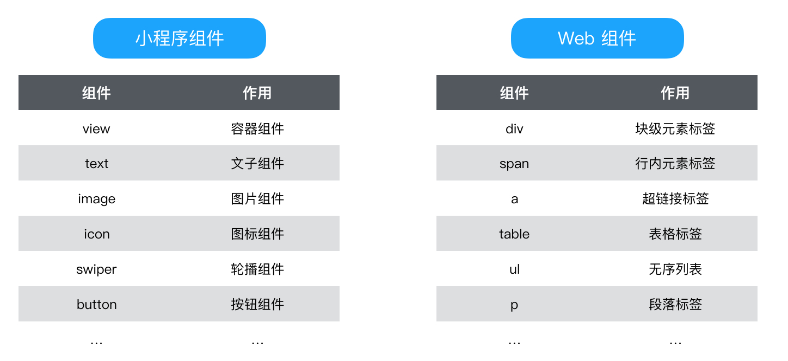
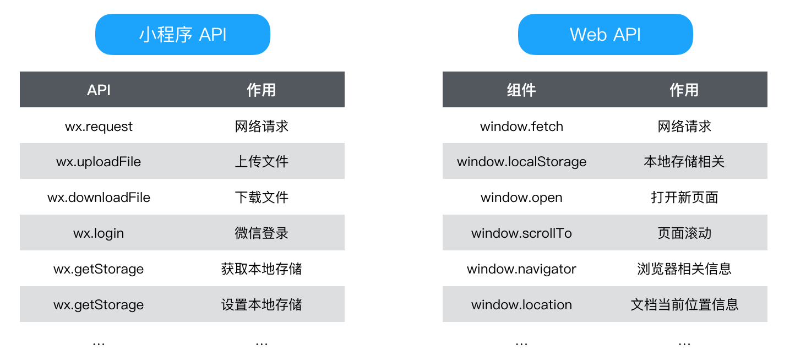
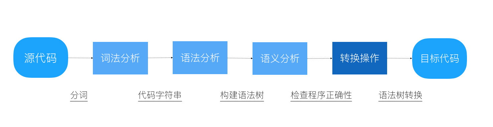
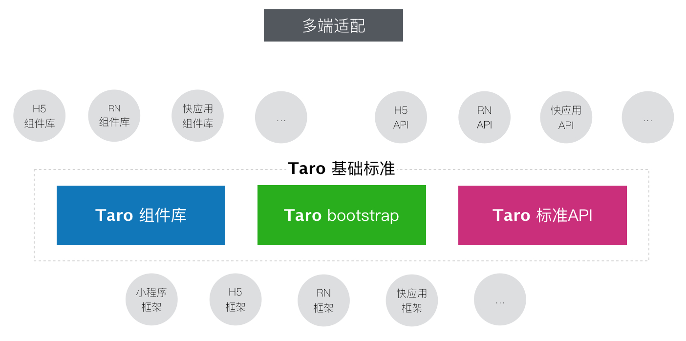
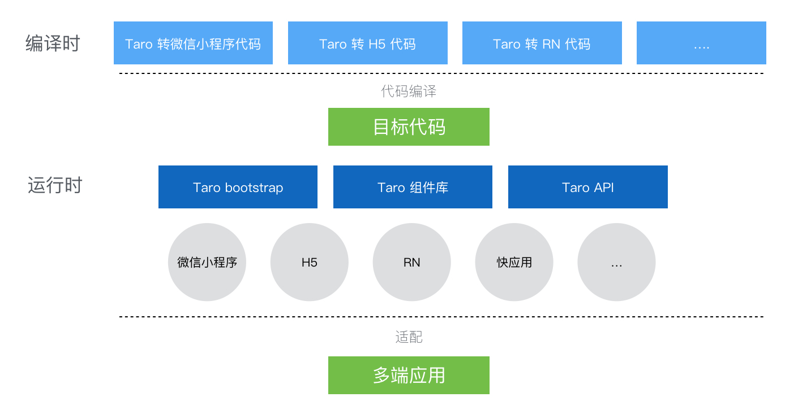

# 深入 Taro 的准备工作

## 设计思想与架构

### 多端差异

每一个平台都不尽相同，这些差异主要体现在不同的组件标准与不同的 API 标准以及不同的运行机制上

### 编译

基于我们对多端差异的认识，那编译是对输入的源代码进行语法分析，语法树构建，随后对语法树进行转换操作再解析生成目标代码 

### 运行时

看出小程序和 Web 端上组件标准与 API 标准有很大差异，仅仅通过代码编译手段是无法抹平的，Taro 采用了定制一套运行时标准来抹平不同平台之间的差异

这一套标准主要以三个部分组成，包括标准运行时框架、标准基础组件库、标准端能力 API，其中运行时框架和 API 对应 @taro/taro ，组件库对应 @tarojs/components ，通过在不同端实现这些标准，从而达到去差异化的目的

