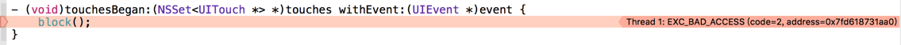
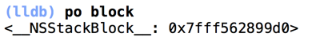
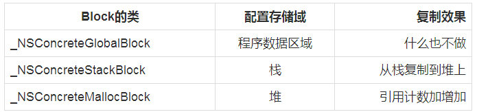

# Block内存管理实例分析

* [iOS内存管理（4）--Block属性用copy修饰 & 避免循环引用的问题](http://blog.csdn.net/winzlee/article/details/51744754)

## 存储域

根据block在内存中的位置，block被分为三种类型：

* NSGlobalBlock是位于全局区的block，它是设置在程序的数据区域（.data区）中???位于text段????
* NSStackBlock是位于栈区，超出变量作用域，栈上的Block以及  __block变量都被销毁。
* NSMallocBlock是位于堆区，在变量作用域结束时不受影响。

注意：在 ARC 开启的情况下，将只会有 NSConcreteGlobalBlock 和 NSConcreteMallocBlock 类型的 block。

### Block的copy、retain、release操作
不同于NSObjec的copy、retain、release操作：

* Block_copy与copy等效，Block_release与release等效；
对Block不管是retain、copy、release都不会改变引用计数retainCount，retainCount始终是1；
* NSGlobalBlock：retain、copy、release操作都无效；
* NSStackBlock：retain、release操作无效，必须注意的是，NSStackBlock在函数返回后，Block内存将被回收。即使retain也没用。容易犯的错误是[[mutableAarry addObject:stackBlock]，（补：在arc中不用担心此问题，因为arc中会默认将实例化的block拷贝到堆上）在函数出栈后，从mutableArray中取到的stackBlock已经被回收，变成了野指针。正确的做法是先将stackBlock copy到堆上，然后加入数组：[mutableArray addObject:[[stackBlock copy] autorelease]]。支持copy，copy之后生成新的NSMallocBlock类型对象。
* NSMallocBlock：支持retain、release，虽然retainCount始终是1，但内存管理器中仍然会增加、减少计数。copy之后不会生成新的对象，只是增加了一次引用，类似retain；
* 尽量不要对Block使用retain操作

### 案例

说了这么多理论的东西，有些人可能很懵，觉得讲这些有什么用呢，我平时使用block并没有什么问题啊，好了，接下来我们先来个感受下：
```
#import "ViewController.h"
 
void(^block)(void);
@implementation ViewController
 
- (void)viewDidLoad {
    [super viewDidLoad];
    NSInteger i = 10;
    block = ^{
        NSLog(@"%ld", i);
    };
}
 
- (void)touchesBegan:(NSSet *)touches withEvent:(UIEvent *)event {
    block();
}
 
@end
```

声明这样一个block，点击屏幕的时候去调用这个block，然后就会发生以下错误：



野指针错误，显而易见，这个是生成在栈上的block，因为超出了作用域而被释放，所以再调用的时候报错了，通过打印这个block我们也可以看到是生成在栈上的：



*解决办法*

解决办法有两种：

Objective-C为块常量的内存管理提供了复制（Block_copy()）和释放（Block_release()）命令。 使用Block_copy()命令可以将块常量复制到堆中，这就像实现了一个将块常量引用作为输入参数并返回相同类型块常量的函数。
```
- (void)viewDidLoad {
    [super viewDidLoad];
 
    NSInteger i = 10;
    block = Block_copy(^{
        NSLog(@"%ld", i);
    });
}
```
为了避免内存泄漏，Block_copy()必须与相应的Block_release()命令达到平衡：
```
Block_release(block);
```

Foundation框架提供了处理块的copy和release方法，这两个方法拥有与Block_copy()和Block_release()函数相同的功能：
```
- (void)viewDidLoad {
    [super viewDidLoad];

    NSInteger i = 10;

    block = [^{        
    	NSLog(@"%ld", i);
    } copy];
}

[block release];
```

到这里有人可能会有疑问了，为什么相同的代码我建了一个工程，没有调用copy，也没有报错啊，并且可以正确打印。 那是因为我们上面的操作都是在MRC下进行的，ARC下编译器已经默认执行了copy操作，所以上面的这个例子就解释了Block超出变量作用域可存在的原因。

接下来可能有人又要问了，block什么时候在全局区，什么时候在栈上，什么时候又在堆上呢？上面的例子是对生成在栈上的Block作了copy操作，如果对另外两种作copy操作，又是什么样的情况呢？



通过这张表我们可以清晰看到三种Block copy之后到底做了什么，接下来我们就来分别看看这三种类型的Block。

### NSGlobalBlock

在记述全局变量的地方使用block语法时，生成的block为_NSConcreteGlobalBlock类对象
```
void(^block)(void) = ^ { NSLog(@"Global Block");};
int main() {
 
}
```

在代码不截获自动变量时，生成的block也是在全局区：
```
int(^block)(int count) = ^(int count) {
        return count;
    };
 block(2);
```

但是通过clang改写的底层代码指向的是栈区：
```
impl.isa = &_NSConcreteStackBlock
```

这里引用巧神的一段话：由于 clang 改写的具体实现方式和 LLVM 不太一样，并且这里没有开启 ARC。所以这里我们看到 isa 指向的还是_NSConcreteStackBlock。但在 LLVM 的实现中，开启 ARC 时，block 应该是 _NSConcreteGlobalBlock 类型

总结下,生成在全局区block有两种情况：

* 定义全局变量的地方有block语法时
* block语法的表达式中没有使用应截获的自动变量时

### NSStackBlock

配置在全局区的block，从变量作用域外也可以通过指针安全地使用。但是设置在栈上的block，如果其作用域结束，该block就被销毁。同样的，由于__block变量也配置在栈上，如果其作用域结束，则该__block变量也会被销毁。

上面举得例子其实就是生成在栈上的block：
```
NSInteger i = 10; 
block = ^{ 
     NSLog(@"%ld", i); 
};
```

除了配置在程序数据区域的block（全局Block），其余生成的block为_NSConcreteStackBlock类对象，且设置在栈上，那么配置在堆上的__NSConcreteMallocBlock类何时使用呢？

### NSMallocBlock

Blocks提供了将Block和__block变量从栈上复制到堆上的方法来解决这个问题，这样即使变量作用域结束，堆上的Block依然存在。
```
impl.isa = &_NSConcreteMallocBlock;
```

这也是为什么Block超出变量作用域还可以存在的原因。

那么什么时候栈上的Block会复制到堆上呢？

* 调用Block的copy实例方法时
* Block作为函数返回值返回时
* 将Block赋值给附有__strong修饰符id类型的类或Block类型成员变量时
* 将方法名中含有usingBlock的Cocoa框架方法或GCD的API中传递Block时

上面只对Block进行了说明，其实在使用__block变量的Block从栈上复制到堆上时，__block变量也被从栈复制到堆上并被Block所持有。

接下来我们再来看一个????：
```
void(^block)(void);
99
int main(int argc, const char * argv[]) {
    @autoreleasepool {
 
        __block NSInteger i = 10;
        block = [^{
            ++i;
        } copy];
 
        ++i;
 
        block();
 
        NSLog(@"%ld", i);
    }
    return 0;
}
```

我们对这个生成在栈上的block执行了copy操作,Block和__block变量均从栈复制到堆上。
然后在Block作用域之后我们又使用了与Block无关的变量：
```
++i;
```
一个是存在于栈上的变量，一个是复制到堆上的变量，我们是如何做到正确的访问这个变量值的呢？

通过clang转换下源码来看下：
```
void(*block)(void);
 
struct __Block_byref_i_0 {
  void *__isa;
__Block_byref_i_0 *__forwarding;
 int __flags;
 int __size;
 NSInteger i;
};
 
struct __main_block_impl_0 {
  struct __block_impl impl;
  struct __main_block_desc_0* Desc;
  __Block_byref_i_0 *i; // by ref
  __main_block_impl_0(void *fp, struct __main_block_desc_0 *desc, __Block_byref_i_0 *_i, int flags=0) : i(_i->__forwarding) {
    impl.isa = &_NSConcreteStackBlock;
    impl.Flags = flags;
    impl.FuncPtr = fp;
    Desc = desc;
  }
};
static void __main_block_func_0(struct __main_block_impl_0 *__cself) {
  __Block_byref_i_0 *i = __cself->i; // bound by ref
            ++(i->__forwarding->i);
        }
static void __main_block_copy_0(struct __main_block_impl_0*dst, struct __main_block_impl_0*src) {_Block_object_assign((void*)&dst->i, (void*)src->i, 8/*BLOCK_FIELD_IS_BYREF*/);}
 
static void __main_block_dispose_0(struct __main_block_impl_0*src) {_Block_object_dispose((void*)src->i, 8/*BLOCK_FIELD_IS_BYREF*/);}
 
static struct __main_block_desc_0 {
  size_t reserved;
  size_t Block_size;
  void (*copy)(struct __main_block_impl_0*, struct __main_block_impl_0*);
  void (*dispose)(struct __main_block_impl_0*);
} __main_block_desc_0_DATA = { 0, sizeof(struct __main_block_impl_0), __main_block_copy_0, __main_block_dispose_0};
int main(int argc, const char * argv[]) {
    /* @autoreleasepool */ { __AtAutoreleasePool __autoreleasepool; 
 
        __attribute__((__blocks__(byref))) __Block_byref_i_0 i = {(void*)0,(__Block_byref_i_0 *)&i, 0, sizeof(__Block_byref_i_0), 10};
        block = (void (*)())((id (*)(id, SEL))(void *)objc_msgSend)((id)((void (*)())&__main_block_impl_0((void *)__main_block_func_0, &__main_block_desc_0_DATA, (__Block_byref_i_0 *)&i, 570425344)), sel_registerName("copy"));
 
        ++(i.__forwarding->i);
 
        ((void (*)(__block_impl *))((__block_impl *)block)->FuncPtr)((__block_impl *)block);
 
        NSLog((NSString *)&__NSConstantStringImpl__var_folders_47_s4m8c9pj5mg0k9mymsm7rbmw0000gn_T_main_e69554_mi_0, (i.__forwarding->i));
    }
    return 0;
}
static struct IMAGE_INFO { unsigned version; unsigned flag; } _OBJC_IMAGE_INFO = { 0, 2 };
```

我们发现相比于没有__block关键字修饰的变量，源码中增加了一个名为 __Block_byref_i_0 的结构体，用来保存我们要 capture 并且修改的变量 i。

在__Block_byref_i_0结构体中我们可以看到成员变量__forwarding,它持有指向该实例自身的指针。那么为什么会有这个成员变量__forwarding呢？这也是正是问题的关键。
我们可以看到源码中这样一句：
```
++(i->__forwarding->i);
```

栈上的__block变量复制到堆上时，会将成员变量__forwarding的值替换为复制到堆上的__block变量用结构体实例的地址。所以“不管__block变量配置在栈上还是堆上，都能够正确的访问该变量”，这也是成员变量__forwarding存在的理由。

### 循环引用

循环引用比较简单，造成循环引用的原因无非就是对象和block相互强引用，造成谁都不能释放，从而造成了内存泄漏。基本的一些例子我就不再重复了，网上很多，也比较简单，我就一个问题来讨论下，也是开发中有人问过我的一个问题：

block里面使用self会造成循环引用吗？  

很显然答案不都是，有些情况下是可以直接使用self的，比如调用系统的方法：
```
[UIView animateWithDuration:0.5 animations:^{
        NSLog(@"%@", self);
    }];
```

因为这个block存在于静态方法中，虽然block对self强引用着，但是self却不持有这个静态方法，所以完全可以在block内部使用self。

还有一种情况：
当block不是self的属性时，self并不持有这个block，所以也不存在循环引用
```
void(^block)(void) = ^() {
        NSLog(@"%@", self);
    };
block();
```
只要我们抓住循环引用的本质，就不难理解这些东西。

[最后附上巧神对Block底层源码实现的讲解](http://blog.devtang.com/2013/07/28/a-look-inside-blocks/)，讲的很透彻，分析的很好！
