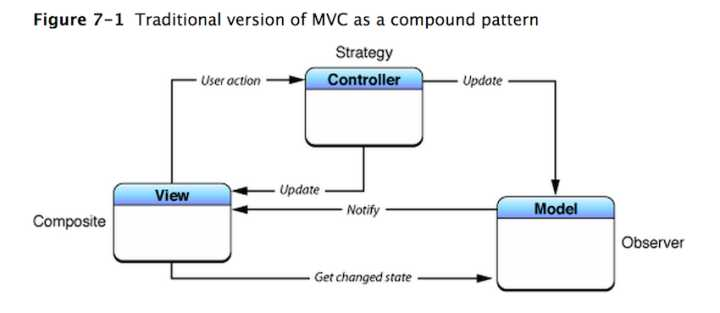
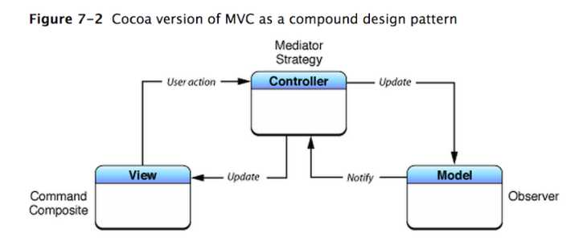
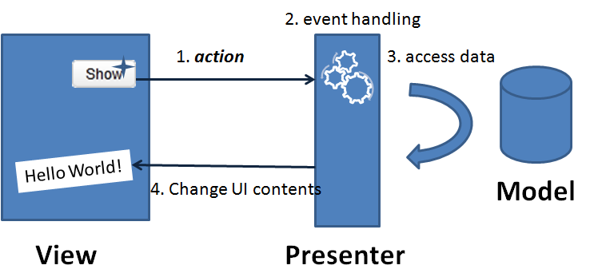
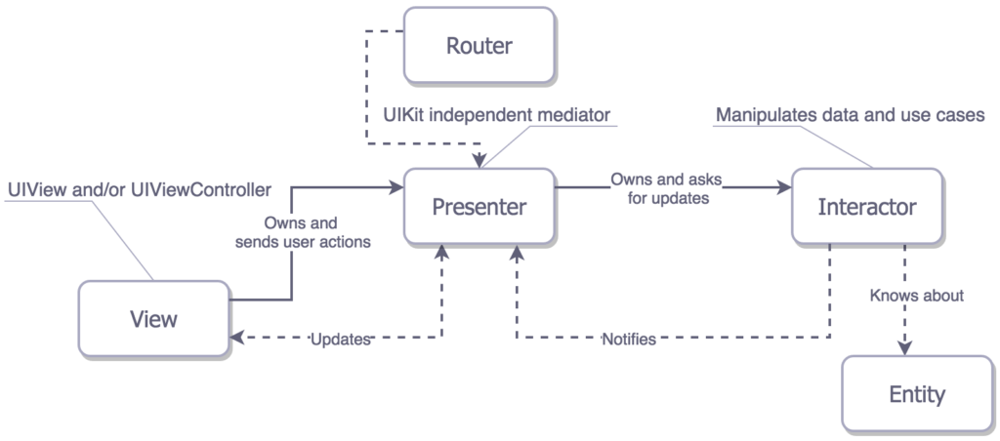
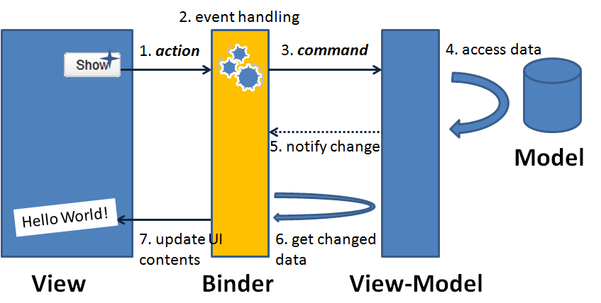

## MVC

讨论它的时候，无法脱离分层架构，可以看[《软件架构入门》by 阮一峰](http://www.ruanyifeng.com/blog/2016/09/software-architecture.html),然而常说的app架构MVC之类的，我把它归到GUI架构，也就是[《GUI Architectures》by Martin Fowler](https://www.martinfowler.com/eaaDev/uiArchs.html)

后面是两篇其他人的文章：[UI 架构小史1（GUI Architectures），实际上是《GUI Architectures》的翻译](http://www.jianshu.com/p/d52e662db75c), [GUI应用程序架构的十年变迁:MVC,MVP,MVVM,Unidirectional,Clean](https://segmentfault.com/a/1190000006016817)

## MVC渊源

* 传统 MVC

* Cocoa MVC

## MVP

## VIPER

### Model

* 责任
	- 提供数据模型

### View (View, ViewController)

### Presenter

* 责任
	- 处理事件响应（大多时候，是和ViewController一起承担的）
	- 做网络请求，或者调用service做数据请求，将结果（需要加工处理）notify给View

### 结构

* 同样，MVP与MVVM很类似，可以将presenter与view controller一对一，也可以将presenter服务于更多的view，这样分工更细、复用方便，但是额外管理负担。
* 尽可能面向协议，避免存在直接M、V、P之间直接引用

## MVVM

## 结构与分工

## app 分层

* 不管是使用MVC、MVVM、MVP、VIPER，移动应用开发，有个基本的分层，以及对应的抽象。根据应用规模的大小，以及层级的厚薄程度，来决定减少抽象（将这部分责任委托给相邻的层级）。
* 上层引用下层、不跨层、不饮用倒置

### 数据层

* 责任：
	- 持久化
	- 传输
	- 序列、反序列化

* 抽象
	- 数据传输对象：贫血模型 model
	- 数据库表存储：实体 entity
	- 数据访问对象：accessor

### 业务逻辑层

* 责任

* 抽象
	- 业务服务对象：service
	- 业务服务／业务流管理对象：manager

### 表现层

* 责任

* 抽象
	- 页面路由器：router
	- 页面控制器：controller
	- 页面视图：view
	- 页面视图模型：viewModel
	- 页面呈现逻辑控制器：presentor / interactor

## 参考链接：
  1. [前端跟后端的MVC架构有什么不同？](http://www.zhihu.com/question/30773646)

## 摘录

1. [前端跟后端的MVC架构有什么不同？](http://www.zhihu.com/question/30773646)

"前端开发的MVC架构核心是事件流；后端开发的核心是数据流。"

2. 
