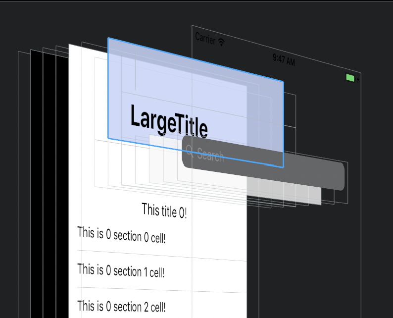

# iOS 11 适配

1. [App界面适配iOS11（包括iPhoneX的奇葩尺寸）](http://www.jianshu.com/p/352f101d6df1), 图文结合，说了很多原理性的知识
2. [你可能需要为你的APP适配iOS11](http://www.jianshu.com/p/370d82ba3939)
3. [iOS 11中APP中tableView内容下移20pt或下移64pt的问题适配的一个总结](https://juejin.im/entry/59b8fbff6fb9a00a62711b64)

## 导航栏

### 导航栏 高度

iOS 11之前的导航栏的高度是64px（状态条+导航栏），iOS11之后如果设置了prefersLargeTitles = YES（默认NO）则为96pt。所以一般不用管



### navigationItem.titleView ui 适配问题

原因：
```
iOS11导航栏titleView图层有变化.
iOS 10及以下 自定义titleView会添加在navigationBar上
iOS 11 添加在UINavigationBarContentView上.
```

### navigationItem.titleView ui引起的事件 适配问题

在iOS11 自定义titleview里有个button,点击事件不触发了.的解决办法如下：
1：在自定义titleview 里重写 intrinsicContentSize 属性，代码如下：
```
@property(nonatomic, assign) CGSize intrinsicContentSize;
```
2：然后在 self.navigationItem.titleView = _titleView; 之前加入下面的代码：
```
_titleView.intrinsicContentSize = CGSizeMake(200, 40);
```
CGSizeMake(200, 40); 宽高 自己根据实际情况自己设置具体值就可以了。这样titleview 里的button 应该就可以点击了。

### 


## 网络


## 列表

### 列表 偏移

在iOS 11上运行tableView向下偏移64px或者20px，因为iOS 11废弃了automaticallyAdjustsScrollViewInsets，而是给UIScrollView增加了contentInsetAdjustmentBehavior属性。避免这个坑的方法是要判断
```
if (@available(iOS 11.0, *)) {
	_tableView.contentInsetAdjustmentBehavior = UIScrollViewContentInsetAdjustmentNever;
} else {
	self.automaticallyAdjustsScrollViewInsets = NO;
}
```

### 列表 分区头部

tableView的sectionHeader、sectionFooter高度与设置不符，因为tableView的estimatedRowHeight、estimatedSectionHeaderHeight、 estimatedSectionFooterHeight三个高度估算属性由默认的0变成了UITableViewAutomaticDimension。最简单的方法就是直接设置为0


## 权限


## 'viewDidLoad'

同样的一段代码
```
AETabBarController

- (void)createViewControllers
{
    self.delegate = self;
    
    AUITheme *theme = [[AdditionalTabBarItemManager sharedManager] themeWithAdditionalTabBarItemInfo:[[AUIThemeManager manager] currentTheme]];
    NSArray *tabBarItemElements = [theme tabbarItemElements];
    _tabCount = [tabBarItemElements count];
    
    NSMutableArray *tempArray = [[NSMutableArray alloc] init];
    for (AUITabbarItemElement *element in tabBarItemElements) {
        UIViewController *viewController = nil;
        switch (element.type) {
            case AUITabbarItemTypeFirst:
            {
                viewController = [[HomeViewController alloc] initWithNibName:@"HomeViewController" bundle:nil];
            }
                break;
            case AUITabbarItemTypeSecond:
            {
                viewController = [[AllGameListViewController alloc] initWithNibName:@"AllGameListViewController" bundle:nil];
            }
                break;
            case AUITabbarItemTypeThird:
            {
                viewController = [[CompetitionListViewController alloc] init];
//                viewController = [[EntertainmentViewController alloc] initWithNibName:@"EntertainmentViewController" bundle:nil];
            }
                break;
            case AUITabbarItemTypeFourth:
            {
                viewController = [[UserCenterViewController alloc] initWithNibName:@"UserCenterViewController" bundle:nil];
            }
                break;
            case AUITabbarItemTypeAdditional:
            {
                viewController = [[AESWebViewController alloc] init];
            }
                break;
            default:
                break;
        }
    
    
    [self setViewControllers:[NSArray arrayWithArray:tempArray] animated: YES];
    
}
```

iOS 10
CompetitionListViewController 的 viewDidLoad 此时不加载，在tabbar上切换的时候加载

iOS 11
CompetitionListViewController 的 viewDidLoad 此时加载


对 self.view 进行访问 (下面的例子，在contentScrollView中有访问, 在' initWithRootViewController:_rootViewController]'时机, _insetCoordinatableContentScrollView和这个有关系？)

```
#0	0x000000010e745230 in -[UIViewController(runtime) pb_viewDidLoad]
#1	0x000000010e8c1606 in -[AEBaseViewController viewDidLoad]
#2	0x000000010e970d36 in -[AESDisplayViewController viewDidLoad]
#3	0x000000010e8007c9 in -[CompetitionListViewController viewDidLoad]
#4	0x00000001132bad51 in -[UIViewController loadViewIfRequired]()
#5	0x00000001132bb19e in -[UIViewController view]()
#6	0x000000010e9736d2 in -[AESDisplayViewController contentScrollView] 
#7	0x00000001132fd84e in _insetCoordinatableContentScrollView ()
#8	0x0000000113306f5f in __71-[UINavigationController pushViewController:transition:forceImmediate:]_block_invoke ()
#9	0x000000011330502b in -[UINavigationController _executeNavigationHandler:deferred:]()
#10	0x0000000113306d1b in -[UINavigationController pushViewController:transition:forceImmediate:]()
#11	0x00000001133061d2 in -[UINavigationController pushViewController:animated:]()
#12	0x00000001132e5cd1 in -[UINavigationController initWithRootViewController:]()
#13	0x000000010e7ca236 in -[AENavigationController initWithRootViewController:]
#14	0x000000010e948aa1 in -[AETabBarController createViewControllers]
#15	0x000000010e759a41 in -[AppDelegate application:didFinishLaunchingWithOptions:]

```


和下面这些呢？
```
self.edgesForExtendedLayout = UIRectEdgeAll;    // 默认就为all
    self.automaticallyAdjustsScrollViewInsets = NO; // 默认为yes
    self.extendedLayoutIncludesOpaqueBars = NO;     // 默认就是no
```

结论：和vc中是否包含 scrollView有关系
```
@property (nonatomic, strong) UICollectionView *contentScrollView;///<
```

编译器识别：contentScrollView，然后调用insetCoordinatableContentScrollView
